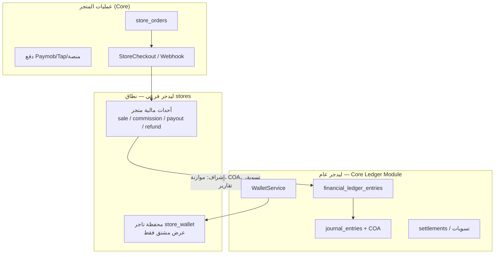

# متاجر داسم — مصادقة موحّدة + ليدجر فرعي تحت الإشراف العام

> **قرار المالك (2026-05-20):** الباكند والـ Auth موحّدان للجميع؛ الليدجر يُبنى **ليدجر فرعي للمتاجر** يشرف عليه **الليدجر العام** في Core وينظّمه.  
> **مرجع أعلى:** `docs/operations/DASM_PLATFORM_CONTROL_LOG.md`، `docs/DASM_ECOSYSTEM_OVERVIEW.md` §3.1، `docs/architecture/unified-login-strategy.md`

---

## 1) مصادقة وباكند موحّدان (لا استثناء للمتاجر)

| الطبقة | المكان | القاعدة |
|--------|--------|---------|
| هوية المستخدم | **Core API** `POST {NEXT_PUBLIC_API_URL}/api/login` (افتراضي Render: `dasm-platform-backend.onrender.com`) | لا SSO redirect، لا Supabase Auth مباشر، لا جدول `users` في Services |
| API المتاجر | **Core API** `/api/stores/*` | `dasm-stores` يحفظ `stores_token` (Sanctum) ويرسل `Authorization: Bearer` |
| واجهة المتاجر | **`dasm-stores`** (Vercel) | عرض + لوحة تاجر + ثيم فقط — **ليست** مصدر حقيقة مالية |
| بيانات تشغيلية للكتالوج | **DASM-services** schema `stores` | ثيمات، اختيارات قوالب، نقل تدريجي لـ `store_*` — **بدون** ليدجر |

**خلاصة:** `dasm-stores` = واجهة؛ **Core** = Auth + Orders + Payments + Ledger.

---

## 1.1) عقد الهوية بين Core و DASM-services

قرار 2026-05-24:

- هوية المستخدم، تسجيل الدخول، التسجيل، التحقق من البريد، إعادة ضبط كلمة المرور، والملف الشخصي كلها في **Core**.
- **DASM-services** لا يحتوي جدول مستخدمين موازي ولا كلمات مرور ولا مصدر صلاحيات.
- ربط المتجر بالمستخدم يتم عبر `stores.user_id = users.id`.
- `owner_type` يبقى وصفا/فلترة فقط، وليس مصدر حقيقة للهوية.
- صفحة تسجيل متاجر داسم تعرض نية واحدة فقط: **صاحب متجر**.
- لا يتم إنشاء متجر تلقائيا لمجرد أن المستخدم `venue_owner` أو صاحب معرض؛ إنشاء المتجر طلب صريح من لوحة داسم أو من واجهة المتاجر.

المرجع الأعلى للتفصيل: `docs/architecture/stores-core-services-identity-contract.md` في ريبو `DASM-Platform`.

---

## 2) الليدجر: فرعي للمتاجر + عام يشرف

### المبدأ

- **الليدجر الفرعي (stores):** كل حركة مرتبطة بـ `store_order` / `store_id` / `store_wallet` — أنواع مثل `store_sale_received`, `store_commission`, `store_payout` (موجودة في `FinancialLedgerEntry`).
- **الليدجر العام:** `App\Modules\Ledger` — `FinancialLedgerService` → قيود يومية عبر `PostJournalFromLedgerEntryAction` → شجرة حسابات (`LedgerCoaCodes`).

**ممنوع:** ليدجر أو محافظ في **DASM-services**. القائمة الحمراء في Ecosystem Overview تبقى سارية.

---

## 3) الوضع الحالي في الكود (مُثبت)

| مكوّن | الحالة | ملاحظة |
|--------|--------|--------|
| `StoreCommissionService` | يكتب `FinancialLedgerEntry` مباشرة | يجب توحيده عبر `FinancialLedgerService::record()` لاحقاً |
| `HOLDER_STORE_WALLET` | معرّف في الموديل | محفظة تاجر = مشتقة من الليدجر |
| `WalletService` | واجهة المحافظ الوحيدة | أي تحديث رصيد عبرها فقط |
| COA لمتاجر | **غير مكتمل** في `LedgerCoaCodes` | يحتاج حسابات مثل `REV_STORE_COMMISSION`, `LIAB_STORE_SELLER_PAYABLE` |
| Auth في `dasm-stores` | Bearer على Core | متوافق مع unified-login |

---

## 4) التصميم المستهدف (تنفيذ تدريجي على Core فقط)

### 4.1 تمييز النطاق (sub-ledger domain)

كل قيد في `financial_ledger_entries` للمتاجر يحمل:

- `source_type = 'store_order'` (موجود)
- `wallet_holder_type = 'store_wallet'` (موجود)
- **`metadata.ledger_domain = 'stores'`** (أو عمود `ledger_domain` عند إضافة migration آمنة عبر Supabase MCP)

### 4.2 تدفق بيع متجر (مثال)

1. Webhook دفع ناجح → `StoreOrder` مدفوع.
2. **Sub-ledger event:** `FinancialLedgerService::record(TYPE_STORE_SALE_RECEIVED, …)` + `TYPE_STORE_COMMISSION`.
3. **General ledger:** `PostJournalFromLedgerEntryAction` ينشر قيداً مزدوجاً على COA المتاجر.
4. **Wallet projection:** `WalletService` يحدّث رصيد عرض التاجر (ريال؛ ليس هللة ExhibitorWallet).

### 4.3 إشراف الليدجر العام

- موازنة القيود، منع القيد غير المتوازن (`UnbalancedJournalPostingException`).
- تسويات وصرف (`settlements`) عبر نفس وحدة Ledger.
- تقارير المنصة تجمع نطاق `stores` + باقي النطاقات (مزادات، خدمات، …) دون خلط الأرصدة.

### 4.4 ما يبقى في DASM-services

- `stores.theme_presets`, `stores.store_theme_selections`, ونقل `store_products` / `store_orders` **تشغيلياً** فقط.
- **لا** `stores.ledger_entries` — الليدجر يبقى في **DASM-core** حتى لو بقي schema `stores` للبيانات التشغيلية.

---

## 5) علاقة بعمل Theme Builder (الجلسة السابقة)

- ثيم المتجر (`theme_id`, `theme_config`) → Core `public.stores` — **لا علاقة بالليدجر**.
- خطة نقل الجداول: `docs/stores/DASM_CORE_MIGRATION_PLAN.md`.
- PR مقترح لـ `dasm-stores`: واجهة فقط؛ أي PR ليدجر المتاجر → **DASM-Platform** فرع قصير (`feat/stores-sub-ledger-alignment`).

---

## 6) خطوات تنفيذ مقترحة (Backend — Core)

| # | مهمة | الريبو |
|---|------|--------|
| 1 | إعادة `StoreCommissionService` → `FinancialLedgerService` + idempotency | DASM-Platform |
| 2 | إضافة COA codes للمتاجر + قواعد posting في `LedgerPostingRuleResolver` | DASM-Platform |
| 3 | ربط webhook دفع المتجر بمسار تسجيل واحد (بيع + عمولة) | DASM-Platform |
| 4 | لوحة تاجر: عرض رصيد من projection فقط (لا حساب محلي) | dasm-stores + Core API |
| 5 | توثيق Control Log بفقرة «stores sub-ledger» | docs |

---

## 7) قواعد ملزمة (من MEMORY / Control Log)

- ⛔ الليدجر = مصدر الحقيقة — المحافظ cache.
- ⛔ `WalletService` فقط لتحريك الأرصدة.
- ⚠️ ExhibitorWallet بالهللة | Wallet بالريال — متاجر التجزئة تتبع **Wallet** (تاجر/مستخدم) وليس محفظة المعرض إلا إذا كان `venue_owner` بنفس الكيان.
